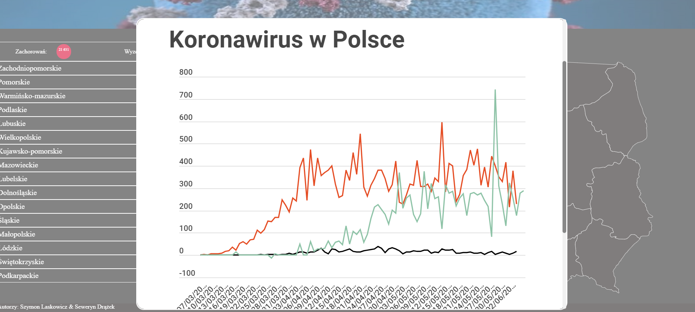
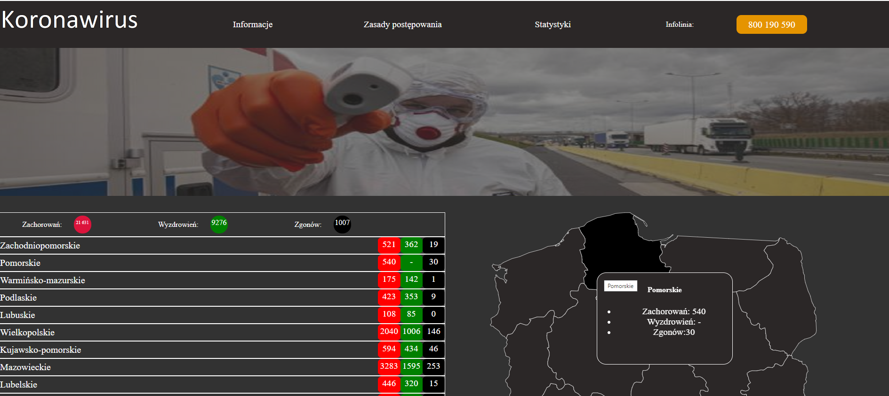

# Platforma-epidemiologiczna

### Epidemiological platform project providing informations on COVID 19 created with javascript/HTML/CSS.

## Table of contents
* [General info](#general-info)
* [Technologies](#technologies)
* [Setup](#setup)

## General info
This project is simple Platform which provides information on COVID - 19. On user panel are:
* interacitive map of Poland 
* table with confirmed cases, recovered and detahs
* menu bar with informations and stats

## Technologies 
* javascript
* HTML
* CSS
* PHP
* MySQL

## Setup
To setup the project download XAMPP and run Apache and MySQL actions

## Images

